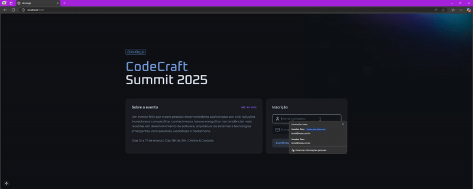

<div align="center">
  <h1>Devstage</h1>
  
  
  
  
</div>

## 📋 Descrição

Devstage é uma aplicação permite aos usuários se inscreverem em eventos e, ao mesmo tempo, participar de um emocionante ranking de indicações. Com uma interface intuitiva e funcionalidades robustas, este sistema foi desenvolvido para incentivar a participação ativa dos usuários, promovendo eventos.

## 🚀 Tecnologias Utilizadas

- [Next.js](https://nextjs.org/)
- [React Hook Form](https://react-hook-form.com/)
- [Zod](https://zod.dev/)
- [Tailwind CSS](https://tailwindcss.com/)
- [Orval](https://orval.dev/)
- [Typescript](https://www.typescriptlang.org/)

## 🛠️ Pré-requisitos

- Node.js (versão 22.11.0)
- npm ou yarn

## ⚙️ Como Executar

1. **Clone o repositório:**
```bash
git https://github.com/JonatanPaes/devstage.git
```

2. **Acesse a pasta do projeto:**
```bash
cd devstage
```

3. **Instale as dependências:**
```bash
npm install
# ou
yarn install
```

7. **Execute o projeto:**
```bash
npm run dev
# ou
yarn dev
```

O projeto estará disponível em `http://localhost:3000`

## 📱 Preview da Aplicação

<div align="center">
  
</div>

## 📄 Licença

Este projeto está sob a licença MIT. Consulte o arquivo [LICENSE](./LICENSE) para mais detalhes.

## 👨‍💻 Autor

Feito por Jonatán Paes

[](https://www.linkedin.com/in/jonatanpaes/)